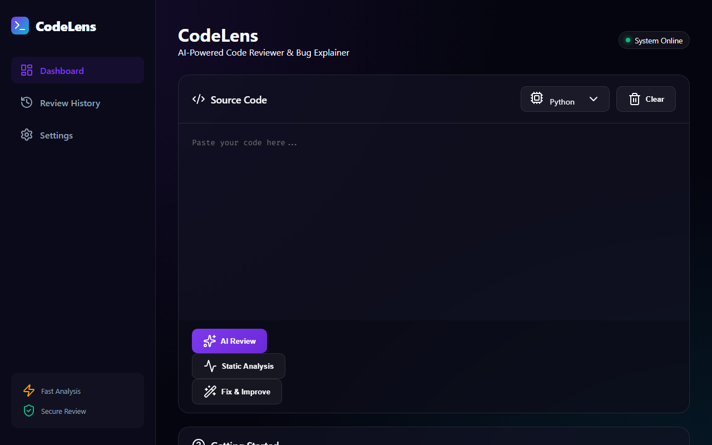
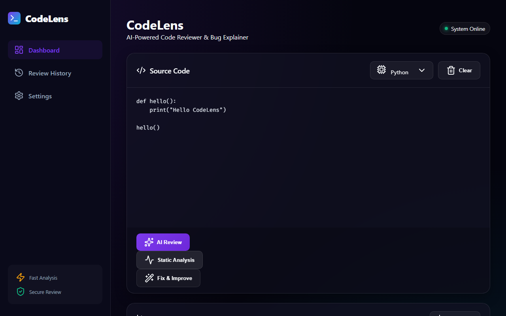
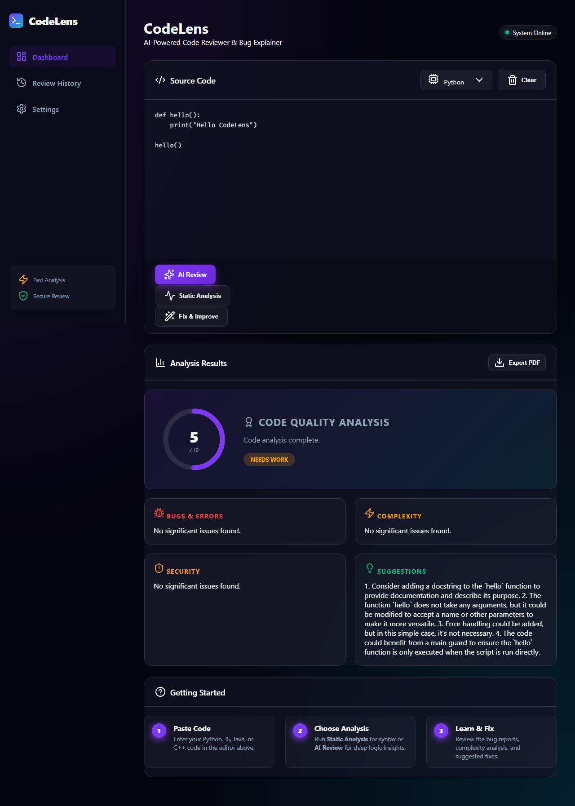

# 🔍 CodeLens
### AI-Powered Code Reviewer & Bug Explainer

## 🚀 Features

- **⚡ AI-Powered Review**: Get instant feedback on your code using state-of-the-art LLMs (Llama 3.3, Mixtral).
- **🐛 Bug Detection**: Identify logical errors and syntax issues before you run your code.
- **⚡ Complexity Analysis**: Understand the Big-O time complexity of your algorithms.
- **🔒 Security Check**: Scan for common vulnerabilities and security best practices.
- **✨ Fix & Improve**: View side-by-side "Before & After" comparisons of suggested improvements.
- **📜 Review History**: Keep track of your past reviews with persistent local storage.
- **⚙️ Custom Settings**: Personalize your experience with custom accent colors, AI models, and analysis depth.

## 📸 Screenshots

### Main Dashboard


### Static Analysis


### AI Review Results


## 🛠️ Tech Stack

- **Frontend**: HTML5, Vanilla CSS3 (Glassmorphism), JavaScript (ES6+)
- **Backend**: Python, Flask, Groq API
- **Icons**: Lucide Icons
- **Syntax Highlighting**: Prism.js

## 📦 Installation

### Prerequisites
- Python 3.8+
- Groq API Key (Get one at [console.groq.com](https://console.groq.com))

### Local Setup
1. **Clone the repository**:
   ```bash
   git clone https://github.com/yourusername/codelens.git
   cd codelens
   ```

2. **Setup the Backend**:
   ```bash
   cd backend
   pip install -r requirements.txt
   ```

3. **Configure Environment**:
   Create a `.env` file in the `backend` directory:
   ```env
   GROQ_API_KEY=your_api_key_here
   ```

4. **Run the App**:
   ```bash
   python app.py
   ```
   The app will be available at `http://127.0.0.1:5000`.

## 🌐 Deployment (Render)

1. **Connect your GitHub repository** to Render.
2. **Create a new Web Service**.
3. **Environment Settings**:
   - **Runtime**: Python
   - **Build Command**: `pip install -r backend/requirements.txt`
   - **Start Command**: `python backend/app.py` (or `gunicorn --chdir backend app:app`)
4. **Environment Variables**:
   - Add `GROQ_API_KEY` with your actual key.

## 📄 License

This project is licensed under the MIT License.
